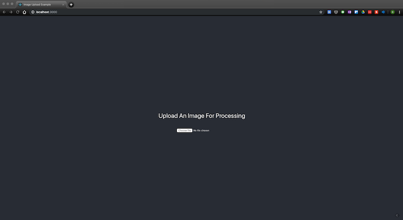
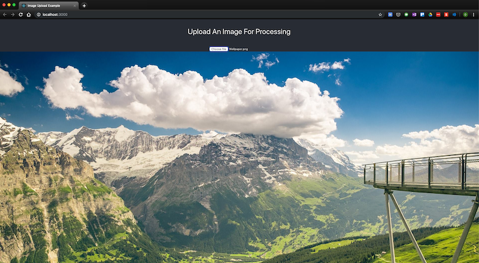

# Example to Upload Image from React to Python Flask

This is a minimal example to show how to upload an image from a React application to a Python Flask backend for processing.

The user can upload an image on the frontend React application, which posts the file to a Flask URL. 

The URL handler on the Flask app 1) fetches the file from the request.files[] object, 2) saves it to a desired location, 3) optionally processes the image (such as performing image manipulation or computer vision) and 4) returns the new images or results as a JSON.

---

## Getting Started With The Example

You will need to run both the frontend and backend applications:

The frontend example is in `frontend-react` folder which was created using the Create React App tool.
1. Navigate into the `frontend-react` folder
2. Run `npm install` to install the dependencies
3. Run `npm start` or `yarn start` to start the application
4. The application will start on http://127.0.0.1:3000/
5. Simply upload an image file after clicking the `Choose File` button

The backend example in `backend-flask/main.py` has a POST route handler that accepts an image, manipulates it and returns a JSON containing a possibly different image with more fields.

1. Download Anaconda or flask manually. If you are using Anaconda, create a virtual environment first with Python >= 3.5 and install `flask` and `flask_cors`
2. Navigate into the `backend-flask` folder
3. Run `env FLASK_APP=main.py flask run` to start the Flask app
4. The server will start listening on http://127.0.0.1:5000/ 
5. When an image is uploaded via the React app, this route handler can:
   1.  Accept the image, 
   2.  Optionally process the image and
   3.  Return the new image with any optional new data fields through a JSON object

---
## Built With
1. Frontend -[Create React App](https://github.com/facebook/create-react-app)
2. Backend - [Python Flask](https://palletsprojects.com/p/flask/)

---
## Further Improvement Ideas
1. Enable drag-and-drop functionality for the frontend file input
2. Style or brand the frontend application
3. Add more image manipulation functions on the Python backend